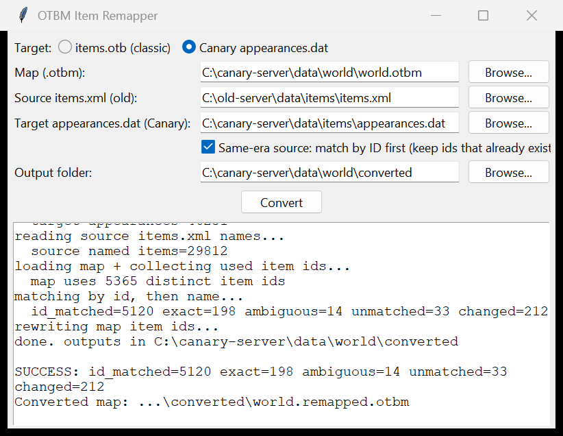

# OTBM Item Remapper

Convert a Tibia `.otbm` map's item IDs from one `items.otb` table to another —
for example, porting an old 0.4/classic 8.60 map onto a modern TFS 1.8/8.60
distro. Items are matched by their shared **clientID**, so an item keeps the same
appearance; only its server ID is rewritten to the value the target `items.otb`
uses.



Build the Windows `.exe` yourself in one step — see
[Building from source](#building-from-source) below. Pure Python standard
library, so no runtime dependencies.

## Usage (the .exe)

Double-click `OTBM Item Remapper.exe` and provide:

1. **Map (.otbm)** — the map to convert.
2. **Source items.otb (old)** — the item table the map was authored against
   (from the old server's `data/items/`).
3. **Target items.otb (new)** — the item table to convert to (your new distro's
   `data/items/`).
4. **Source items.xml (optional)** — only needed to auto-generate definitions for
   genuinely custom items; leave empty if not needed.
5. **Output folder** — where results are written (defaults to a `converted`
   folder next to the map).

Click **Convert**. Outputs:

- `<MapName>.remapped.otbm` — the converted map. Rename to your map name and drop
  it in the server's `data/world/`.
- `items.otb` — the target table (plus any relocated custom items). With zero
  customs this equals your target `items.otb`, so you can keep using that one.
- `items.custom.xml` — definitions for relocated custom items (only if customs
  were found and a source `items.xml` was supplied).
- `remap-report.md`, `remap.json` — a summary and the full old->new ID bridge.

The map's `-spawn.xml` / `-house.xml` etc. carry over unchanged (they hold
names/positions, not item IDs).

## Targeting Canary (appearances.dat)

Canary (and OTServBR-Global / modern forks) dropped `items.otb` — item appearances
live in `appearances.dat` (protobuf). For these targets, pick **"Canary
appearances.dat"** at the top of the window. Items are matched by **name** instead
of clientID:

1. **Map (.otbm)** — the map to convert.
2. **Source items.xml (old)** — your old server's `items.xml` (provides item names).
3. **Target appearances.dat (Canary)** — from Canary's `data/items/`.
4. **Output folder**.

You get `<MapName>.remapped.otbm` plus `remap-report.md` listing **exact**,
**ambiguous** (auto-resolved to the lowest id), and **unmatched** items.

**Same-era source?** If your source map is already from an appearances-era server
(another Canary/OTServBR fork), tick **"Same-era source: match by ID first"**. Any
item id that already exists in the target Canary is kept as-is (fast and exact),
and only the rest fall back to name matching — so 12+ → Canary conversions come out
near-identical instead of being re-matched by name.

**This is a best-effort conversion, not a perfect port.** Items that don't exist in
Canary by name are left with their original IDs and listed in the report — fix the
tail in a map editor. Same-era maps (12+ → Canary) match near-perfectly; old→new
(8.6/10.x → Canary) will have a meaningful unmatched/synonym tail because names and
sprites were reorganized across that boundary.

## How it works

Both `items.otb` files share the 8.60 client item set. For each item ID used on
the map, the tool reads its clientID in the source table and finds the target
table's server ID for that same clientID. Items whose clientID has no match in
the target are relocated to fresh free IDs.

## Safety

- Outputs are written only if the whole conversion succeeds — a failure never
  leaves a half-broken map.
- The OTBM client-version field is left untouched (rewriting it makes the engine
  reject the map).

## Known limits

- Models the OTBM tile attributes the TFS engine defines (`TILE_FLAGS` incl. the
  ZONE zone-id list, and inline ground `ITEM`). Any other/unknown tile attribute
  makes the tool **stop and report** rather than risk corrupting the map. If you
  hit this, share the map so coverage can be extended.
- OTBM maps only.

## Building from source

```powershell
pip install pyinstaller
./build.ps1
```
Produces `dist\OTBM Item Remapper.exe`. The source is pure Python standard
library (tkinter GUI), so the exe has no external runtime dependencies.

## License

[MIT](LICENSE) © mcbisken
